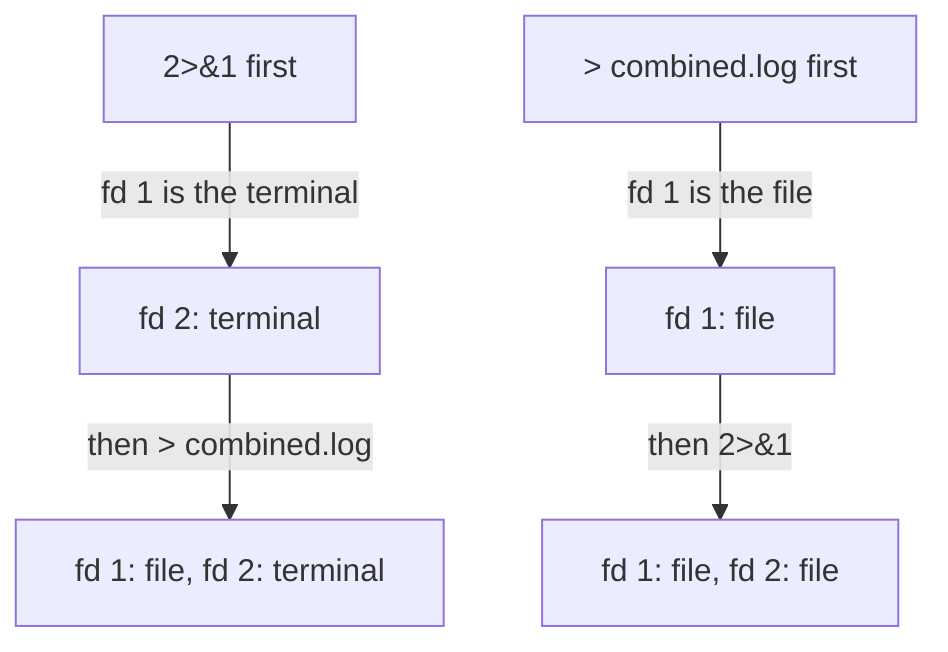

# Combining Both Streams In The Right Order

Astronaut, sometimes you want every report and every alarm from a crew member in one log, in the order they happened. Bash can patch both signal lines into the same file, but only if you give the orders in the right order. This part shows the correct form, the reversed form that looks almost the same and silently loses the errors, and the short form bash offers.

A quick reminder of the names: **stdout** is a program's normal output on file descriptor 1 (fd 1), and **stderr** is its warnings and errors on file descriptor 2 (fd 2). A file descriptor is the numbered socket a signal line plugs into.

## Both streams into one file

Bash reads redirections **from left to right**, one at a time. That order is the most tested trap in this whole topic, so it is worth reading slowly.

### The correct order

```bash
backup-tool > combined.log 2>&1
```

Read it exactly the way bash does, one piece at a time:

1. `> combined.log`: fd 1 now points at `combined.log`.
2. `2>&1`: fd 2 now points at "wherever fd 1 points right now". Fd 1 was just pointed at `combined.log` in step 1, so fd 2 points there too.

Result: both streams land in `combined.log`.

### The reversed order

Now swap the two pieces:

```bash
backup-tool 2>&1 > combined.log
```

1. `2>&1`: fd 2 now points at "wherever fd 1 points right now". At this moment fd 1 still points at the terminal, because nothing has moved it yet. So fd 2 points at the terminal.
2. `> combined.log`: fd 1 now points at `combined.log`.

Result: fd 1 goes to the file, but fd 2 still points at the terminal from step 1. It was never told to follow fd 1's later move. `combined.log` ends up with stdout only, and the errors you wanted scroll past on the screen.



The diagram shows the two orders side by side: `2>&1` copies where fd 1 points at that instant, so it only follows the file when the file redirection came first.

This is not a bug or an inconsistency in bash. It is the direct result of reading redirections strictly left to right. Each one copies the *current* target at that instant. It does not create a live link that updates later.

## The `&>` shorthand

Bash also has a short form for the common "send both to the same file" case:

```bash
backup-tool &> combined.log
```

`&>` does the same as `> combined.log 2>&1`. But it is a feature of bash (and zsh), not of the portable POSIX shell standard. If a script must also run correctly under `sh` or `dash`, use the portable `> file 2>&1` form instead.

## Try it: compare the two orders

You can prove the order rule with a test script that writes one line to each stream. If you already saved `two-streams.sh` and made it executable, skip the next two steps.

Save this as `two-streams.sh` in your home directory:

```bash
#!/bin/bash
echo "ok"
echo "warn" >&2
exit 3
```

Apply it:

```sh
chmod +x two-streams.sh
```

### Run both orders

Run the script once with the correct order and once with the reversed order, each into its own file:

```sh
./two-streams.sh > all.log 2>&1
./two-streams.sh 2>&1 > all-reversed.log
```

The first command prints nothing on your terminal. The second one prints `warn`, because in the reversed order stderr stayed on the terminal.

### Compare the files

Then check the result:

```sh
cat all.log
```

```text
ok
warn
```

```sh
diff all.log all-reversed.log
```

```text
2d1
< warn
```

`all.log` holds both lines. `diff` shows that the reversed file is missing the `warn` line: bash had already pointed stderr at the terminal before stdout moved to the file.

> [!TIP]
> Read every redirection out loud from left to right before you press Enter: "stdout to the file, then stderr to wherever stdout is now". If the sentence sounds wrong, the order is wrong.

## Common pitfalls

> [!WARNING]
> - **Writing `2>&1` before the file.** `cmd 2>&1 > file` captures stdout only. The correct form is `cmd > file 2>&1`.
> - **Thinking `2>&1` is a live link.** It copies where fd 1 points at that moment. A later move of fd 1 does not take fd 2 with it.
> - **Using `&>` in a script that runs under `sh`.** `&>` is a bash feature. Use `> file 2>&1` when the script must be portable.
