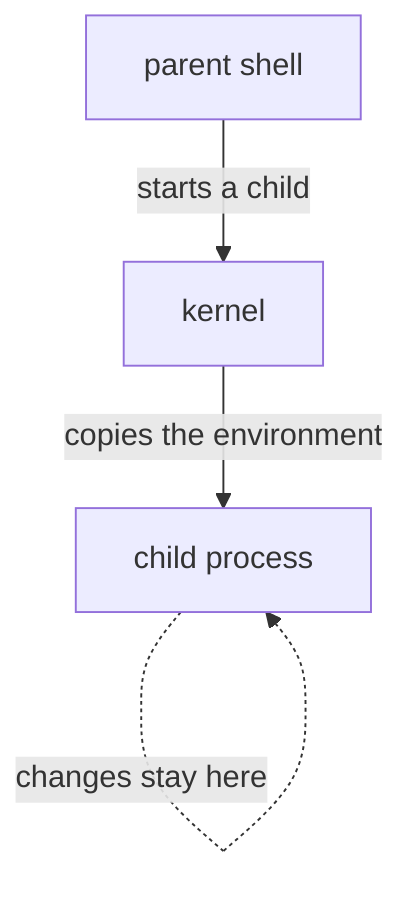

# Shell Variables And Export

Astronaut, a crew member who starts a new crew member hands over a briefing pack, and the new crew member only knows what is in that pack. This part shows the difference between a note on your console, which nobody else sees, and a line in the briefing pack, which every new crew member receives. On Linux these are a shell variable and an environment variable.

## The environment is copied, once

Every process on Linux carries a private list of name and value strings called its **environment**. When a process starts a **child process** (a shell running a script, or a script calling another program), the new process gets a copy of that list in its own memory. The kernel, the ship's core, does the copying when the child is created.

The child gets its own, separate copy. It can change or delete entries without affecting the parent. The parent cannot see anything the child adds later. This one-way copy, made at the moment the child starts, is the whole mechanism.



The diagram shows the copy going one way only: from parent to child, at the moment the child starts.

It is simpler than it sounds once you stop assuming that "a variable" and "an environment variable" are the same thing. They are not.

- Every variable you create in bash starts as a **shell variable**: a name and value known only to the current shell process. It is a note on your own console, invisible to anything the shell starts.
- It becomes an **environment variable**, which is copied into child processes, only once you `export` it. "Environment variable" really means "a shell variable that has been exported": a line you put into the briefing pack.

## A shell variable goes nowhere

By default, bash keeps a new variable to itself. You can see this with one variable and one child shell.

### Set a variable and read it

```bash
GREETING="hello"
echo "$GREETING"        # prints: hello
```

This works inside the current shell. Now let a separate process try to read it:

```bash
GREETING="hello"
bash -c 'echo "$GREETING"'     # prints: (nothing)
```

### Why the child sees nothing

`bash -c '...'` starts a brand-new child shell process. That child gets a copy of its parent's *environment*. But `GREETING` was never put into the environment, only into the parent shell's private list of variables, so the child cannot see it.

This surprises people all the time: "I just set it, why can't my script see it?" The answer is that your script usually runs as its own process, not inside your interactive shell.

## `export` marks a variable for children

`export` is the order that puts a variable into the briefing pack. Here is the same example with it:

```bash
export GREETING="hello"
bash -c 'echo "$GREETING"'     # prints: hello
```

### What `export` really does

`export` does not create a new kind of variable, and it does not copy the value anywhere right away. It marks the existing shell variable. From then on, bash gives every child process it starts a copy of that variable in its environment.

### Check what is exported

You can see every variable that is currently marked for children:

```bash
export -p
```

Bash lists every exported name, one per line, in the form `declare -x NAME="value"`. This is useful when a program does not see a value you expected: check whether the variable is a plain shell variable or really exported before you assume anything.

## Try it: watch a variable cross into a child

These steps follow one variable from your console into the briefing pack.

### Set it without export

Set a variable with no `export`, and read it in your own shell:

```sh
LOCAL_ONLY=abc
echo $LOCAL_ONLY
```

```text
abc
```

Now ask a child shell for it:

```sh
bash -c 'echo "LOCAL_ONLY is: $LOCAL_ONLY"'
```

```text
LOCAL_ONLY is: 
```

The child prints nothing after the colon. It never received the variable.

### Export it and ask again

Export the existing variable. You do not need to set the value again:

```sh
export LOCAL_ONLY
bash -c 'echo "LOCAL_ONLY is: $LOCAL_ONLY"'
```

```text
LOCAL_ONLY is: abc
```

Then check the result in the list of exported variables:

```sh
export -p | grep LOCAL_ONLY
```

```text
declare -x LOCAL_ONLY="abc"
```

The variable is now in the environment, so every child shell started from here gets a copy.

## Common pitfalls

> [!WARNING]
> - **Expecting a child to see a plain variable.** `NAME=value` stays in the current shell. Only `export NAME` puts it into the environment that children receive.
> - **Expecting a child's changes to come back.** A child gets a copy. Anything it changes or adds stays in the child.
> - **Guessing instead of checking.** Run `export -p | grep NAME` to see whether a variable is really exported.
