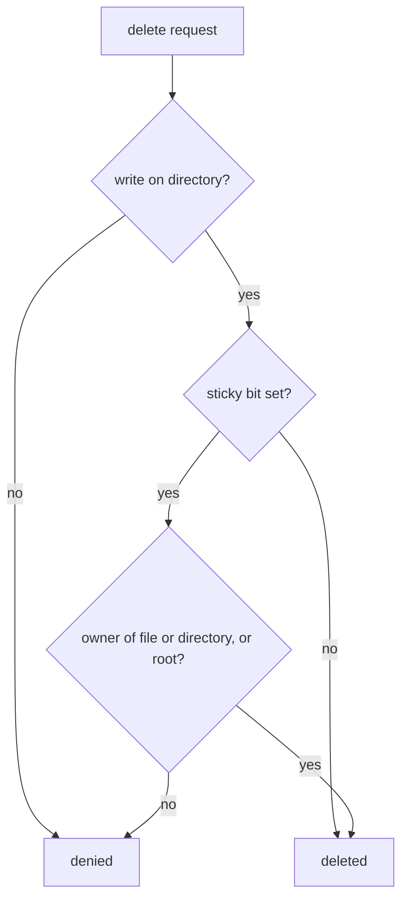

# The Three Special Bits

Astronaut, the nine normal permission bits say who may look at a crate, change it or run it. Some compartments on a shared ship need rules beyond "open" or "locked". A supply compartment where every crate dropped inside gets the team's tag. A shared locker where anyone may store a crate, but only its owner may take it out again. This part covers the three special bits that make those rules: setuid, setgid and the sticky bit.

The kernel, the ship's core, still does all the checking. The special bits only change what it checks, or which identity it uses.

## The fourth digit

Beyond the nine standard bits, three more bits control special behaviour. They live in an optional fourth octal digit, written in front of the usual three. Because three-digit modes are so common, this fourth digit is the one people forget.

| Bit | Value | Letter in `ls -l` | Symbolic `chmod` |
| --- | --- | --- | --- |
| setuid | `4000` | `s` in the owner's execute slot | `chmod u+s` |
| setgid | `2000` | `s` in the group's execute slot | `chmod g+s` |
| sticky | `1000` | `t` in the other's execute slot | `chmod +t` |

Special bits add up like the normal ones when more than one applies. `4000 + 2000 + 1000 = 7000` would set all three at once, although that combination is rare.

## Setuid (`4000`): run as the owner

Setuid (short for "set user ID") is an order carried out with the owner's rank, not the caller's. Placed on a program file, it means: whoever runs this program, the kernel runs it with the file owner's privileges, not with the privileges of the person who started it.

This is how `passwd` lets an ordinary user change their own password. The password database can only be written by root. `passwd` is owned by root and has setuid, so it runs as root for that one operation, then hands control back. You see setuid as an `s` in the owner's execute slot: `-rwsr-xr-x`.

## Setgid (`2000`): two different jobs

Setgid (short for "set group ID") does something different on a file than on a directory. Mixing the two up is one of the most common points of confusion, so this section takes them one at a time.

### Setgid on a program file

On a program file, setgid works like setuid, but for the group. The program runs with the file's group privileges instead of the group privileges of the person who started it.

### Setgid on a directory

On a directory, setgid has a far more useful everyday job: every crate stored here gets the team's tag. Any new file or subdirectory created inside automatically gets the directory's group, instead of the creating user's own primary group.

Without setgid, each teammate's new files land in their own personal group. Then other team members cannot reach those files through their group membership. With setgid, everything lands in the team's group automatically:

```bash
sudo chown root:launch-team /srv/projects/launch-team
sudo chmod 2770 /srv/projects/launch-team
```

`2770` is setgid (`2000`) plus `770`: the owner and the group get full `rwx`, and everyone else gets nothing. From now on, anything a `launch-team` member creates inside belongs to group `launch-team`. Nobody has to remember to run `chgrp` afterwards.

Setgid only affects entries created after you set the bit. It does not change the group of files that were already there. A subdirectory created before the parent had setgid does not get the behaviour either, unless you set setgid on it directly too.

### Try it: build a team compartment

Create a test group, a crew member in that group, and a directory owned by the group. `useradd -m -G launch-team cadet` creates the user `cadet` with a home directory and adds `cadet` to `launch-team` as an extra group. Ubuntu gives `cadet` its own primary group, also called `cadet`:

```bash
sudo groupadd launch-team
sudo useradd -m -G launch-team cadet
sudo mkdir -p /srv/projects/launch-team
sudo chown root:launch-team /srv/projects/launch-team
sudo chmod 2770 /srv/projects/launch-team
stat -c '%a %A' /srv/projects/launch-team
```

```text
2770 drwxrws---
```

The `s` in the group's execute slot is the setgid bit. Now let `cadet` create a file inside, and check the file's group. You need `sudo` for the check, because your own user is "other" here and gets nothing:

```bash
sudo -u cadet touch /srv/projects/launch-team/flight-plan.txt
sudo stat -c '%G' /srv/projects/launch-team/flight-plan.txt
```

```text
launch-team
```

The file belongs to `launch-team`, not to `cadet`'s own primary group. The kernel gave it the directory's group because of setgid.

## Sticky (`1000`): protect crates in a shared space

The sticky bit turns a directory into a shared locker: anyone may store a crate, but only its owner may remove it. To see why that matters, first look at how deletion works without it.

### Why plain write access is not enough

Write access to a directory is all or nothing. If you can write into a directory, you can delete or rename any file in it, whoever owns that file. Deleting a file removes its name from the directory, so the kernel checks the directory's permissions, not the file's.

That is a problem as soon as a directory must be writable by everyone, like a shared drop folder. Anyone who can drop a file in could also remove someone else's file.

### What the sticky bit changes

On a directory, the sticky bit limits deletion and renaming to the file's own owner, the directory's owner, or root. The directory itself stays fully writable by everyone.



The diagram shows the check the kernel makes when someone tries to delete a file from a directory: the sticky bit adds one more question about who owns the file.

```bash
sudo mkdir -p /srv/uploads/public-drop
sudo chmod 1777 /srv/uploads/public-drop
```

`1777` is sticky (`1000`) plus `777`: everyone gets full `rwx`. The system directory `/tmp` uses exactly this pattern. Run `ls -ld /tmp` on any Linux machine and the first column reads `drwxrwxrwt`.

### Reading `t` and `T`

The trailing `t` in lowercase means the sticky bit and the other-execute bit are both set. That is the normal combination. An uppercase `T` means the sticky bit is set but other-execute is missing. That is unusual and worth a closer look if you see it.

The same rule holds for `s` and `S` in the owner and group slots: lowercase means the special bit and execute are both set, uppercase means execute is missing.

### Try it: a shared drop folder

Make the drop folder and read its mode back:

```bash
sudo mkdir -p /srv/uploads/public-drop
sudo chmod 1777 /srv/uploads/public-drop
stat -c '%a %A' /srv/uploads/public-drop
```

```text
1777 drwxrwxrwt
```

Check that the last letter is a lowercase `t`, not an uppercase `T`.

### Try it: lock a script to its owner

Owner-only access needs no special bit at all. Create a small script and give it `700`:

```bash
touch /tmp/owner-only.sh
chmod 700 /tmp/owner-only.sh
stat -c '%a %A' /tmp/owner-only.sh
```

```text
700 -rwx------
```

The owner can read, change and run it. The group and everyone else get nothing.

> [!TIP]
> After setting any special bit, check the result with `stat -c '%a %A' <path>`. The four-digit number shows the bit was stored, and the letter (`s`, `t`) shows it in the place you expect.

## Common pitfalls

> [!WARNING]
> - **Dropping the fourth digit.** `chmod 770` on a team directory removes setgid. Write `2770`.
> - **Expecting setgid to fix existing files.** It only affects files created after the bit is set. Older files keep their group.
> - **Mixing up setgid on a file and on a directory.** On a program it changes which group the program runs as. On a directory it sets the group of new entries.
> - **Trusting plain `777` on a shared folder.** Anyone can then delete anyone's files. Add the sticky bit: `1777`.
> - **Ignoring an uppercase `T` or `S`.** It means the special bit is set but the execute bit under it is missing.

## Your mission: chmod Permission Bits Lab

You can now set setgid on a team directory, lock a script to its owner, and protect a shared folder with the sticky bit. The mission asks you to do all three on a fresh training ship, where a member of the `analysts` team must find their new files tagged with the team's group.

Start the mission:

```sh
astrona run --git ssh://git@github.com/astrona-io/ATS006.git -c labs/lab-021
```

Open a terminal on the lab machine:

```sh
astrona ssh ats-006-lab-021
```

Read the task in [the question](../../../labs/lab-021/docs/question.md) and solve it on your own first. When you think you are done, send it for grading:

```sh
astrona submit -c labs/lab-021
```

When the mission is done, remove it:

```sh
astrona destroy ats-006-lab-021
```
