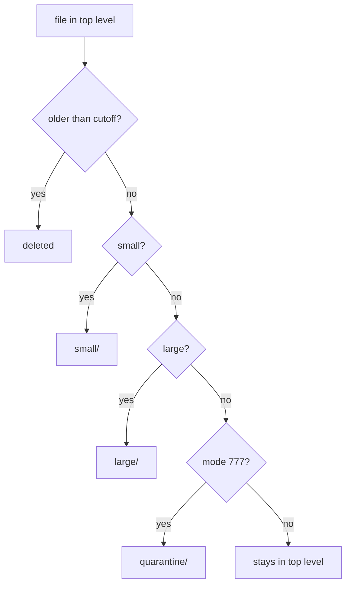

# Triage In The Right Order

Astronaut, a real cleanup is never one `find` command. It is several passes over the same cargo compartment: throw out the old crates, then sort what is left by size, then pull out the crates with dangerous locks. This part shows why the order of those passes changes the result, and how `-maxdepth 1` keeps each pass from touching crates an earlier pass already moved.

Picture a crew member sorting a returns cart. If they first pull out the damaged crates, then the oversized ones, then the restricted ones, each pass only deals with what the previous pass left behind. Do it in another order, say oversized first, and some damaged crates end up on the oversized shelf instead of being thrown out. `find` triage works exactly the same way.

## Two traps that break a triage

Multi-step triage almost always has to run in a set order. Getting it wrong produces a result that looks nearly right, which makes it easy to miss. This section covers the two traps that show up again and again.

### Destination folders created too early

If the destination folders (`tiny/`, `oversized/`, `quarantine/`) already exist when a size or permission pass runs, that pass's `find` happily walks into them too. It can match files an earlier pass already sorted, and move them again, sometimes into the wrong place.

`-maxdepth 1` guards against this. It limits each pass to files directly inside the parent folder, and `find` never walks down into subfolders. Create the destination folders only after any delete pass, and put `-maxdepth 1` on every pass.

### Deleting after sorting instead of before

Say a task reads "delete old files, then sort what is left by size". If you sort by size first and delete by age second, "what is left" means something different. Old files that should have been deleted get sorted into a subfolder first. A later delete pass limited with `-maxdepth 1` never looks in that subfolder, so those old files survive.

When a task spells out an order, that order usually exists to prevent exactly this kind of overlap. Reordering steps "to be efficient" without checking the side effects is a common way to end up with a different, wrong result.

## The first matching pass wins

Some files fit more than one rule, for example small and mode `777`. This section shows who claims such a file.

### Order decides

`find` does not know about your other passes. A file that fits two rules goes to whichever pass runs first. Once that pass moves it out of the parent folder, later passes limited with `-maxdepth 1` simply never see it again.



The diagram shows one file's path through four passes run in order: the first test it passes decides where it ends up, and a small file with mode `777` lands in `small/`, never in `quarantine/`. That is a feature, not a bug, as long as you follow the order the task gives.

## A full triage, step by step

Here is the whole method on a test folder you build yourself. It includes one file that fits two rules, so you can see the first pass claim it.

### Try it: build a mixed folder

Each `head -c` line writes a file of an exact size, and `touch -d` backdates one file:

```bash
mkdir -p /tmp/triage-order
cd /tmp/triage-order
head -c 1024 /dev/zero > old-log.txt
touch -d "2019-05-01" old-log.txt
head -c 1024 /dev/zero > small.txt
head -c 1024 /dev/zero > small-open.cfg
chmod 777 small-open.cfg
head -c 20480 /dev/zero > big.bin
head -c 5120 /dev/zero > open.sh
chmod 777 open.sh
head -c 5120 /dev/zero > keep.dat
```

`small-open.cfg` is both small and mode `777`. `keep.dat` is mid-sized with a normal mode, so no rule should touch it.

### Try it: delete first, then create the destinations

Preview the age pass, then delete:

```bash
find . -maxdepth 1 -type f ! -newermt "2022-06-01" -print
find . -maxdepth 1 -type f ! -newermt "2022-06-01" -delete
```

```text
./old-log.txt
```

Only now create the destination folders, so no earlier pass could have walked into them:

```bash
mkdir -p small large quarantine
```

### Try it: size passes, then the permission pass

Run the passes in the order small, large, permission:

```bash
find . -maxdepth 1 -type f -size -3k -exec mv {} small/ \;
find . -maxdepth 1 -type f -size +10k -exec mv {} large/ \;
find . -maxdepth 1 -type f -perm 0777 -exec mv {} quarantine/ \;
```

Then check where everything landed. `sort` gives the list a fixed order:

```bash
find . -type f | sort
```

```text
./keep.dat
./large/big.bin
./quarantine/open.sh
./small/small-open.cfg
./small/small.txt
```

`small-open.cfg` went to `small/`, because the size pass ran first and moved it before the permission pass looked. Only the mid-sized `open.sh` reached `quarantine/`, and `keep.dat` stayed in the top level. A final `find . -maxdepth 1 -type f` would list only `./keep.dat`.

## Common pitfalls

> [!WARNING]
> - **Creating destination folders before the passes run.** Without `-maxdepth 1`, later passes walk into them and move files again.
> - **Leaving out `-maxdepth 1` on one pass.** That pass alone can undo earlier sorting.
> - **Reordering the steps.** Deleting after sorting lets old files survive inside subfolders. Follow the order the task gives.
> - **Expecting a file that fits two rules to go to the later rule.** The first pass that matches it moves it, and later passes never see it.
> - **Forgetting `sudo` on a folder owned by `root`.** `find` reports "Permission denied" and moves nothing. Check the folder's owner with `ls -ld` first.

## Your mission: find Triage by Criteria Lab

You can now delete files by an absolute date, sort the rest by size and by exact permission, and keep each pass from touching the work of the one before. The mission asks you to clean up a backup folder in four passes, in a fixed order, where some files fit two rules.

Start the mission:

```sh
astrona run --git ssh://git@github.com/astrona-io/ATS006.git -c labs/lab-023
```

Open a terminal on the lab machine:

```sh
astrona ssh ats-006-lab-023
```

Read the task in [the question](../../../labs/lab-023/docs/question.md) and solve it on your own first. When you think you are done, send it for grading:

```sh
astrona submit -c labs/lab-023
```

When the mission is done, remove it:

```sh
astrona destroy ats-006-lab-023
```
