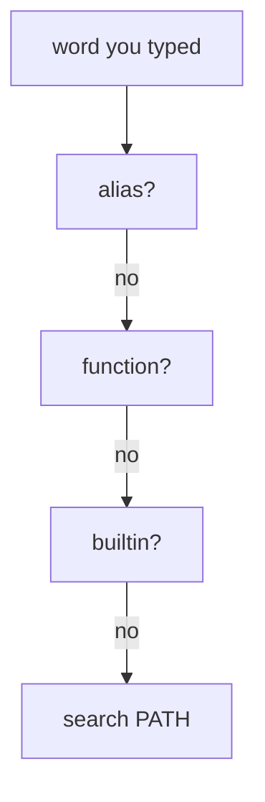

# How Bash Expands An Alias

Astronaut, an **alias** is a nickname for an order: a short word that `bash`, the shell, swaps for a longer command before it runs anything. In this part you see where that swap happens, how to check what a name really runs, how to make an alias last, and when a short standard procedure, a shell function, is the better tool.

## Where aliases sit in the lookup order

When you type a word at the prompt, `bash` does not go straight to `PATH`, the list of folders it searches for programs. It checks a fixed order first. This section shows that order and why it matters.

### Aliases are checked first

`bash` asks, in this order:

1. Is this word an alias?
2. Is it a shell function?
3. Is it a builtin (a command built into `bash` itself)?
4. Only then: is there a matching program file in a `PATH` folder?



`bash` stops at the first step that matches, so an alias always wins over a real command with the same name, with no warning that a swap happened.

Here is a real example:

```bash
alias ls='ls --color=auto'
```

Type `ls` after this, and you always run `ls --color=auto`, not plain `ls`, even though you typed the same two letters as always. This is on purpose, and for a sensible alias like this one it is harmless. The risk only shows up when the swapped-in behaviour is very different from what the name normally means.

### Check what a name really runs

Rather than guessing whether odd behaviour comes from an alias, a function or the real program, ask `bash` directly:

```bash
type ls
```

`type` reports exactly what a name resolves to. It says `ls is aliased to 'ls --color=auto'`, or gives a plain file path if the name is not an alias, or says `ls is a function` if someone defined a shell function with that name.

> [!TIP]
> When a standard command "isn't behaving like the manual page says", run `type` on it first. A stray alias, maybe defined months ago and long forgotten, is one of the most common causes.

## Temporary and permanent aliases

An alias you type at the prompt does not survive the session. This section shows both kinds and how to turn one into the other.

### A temporary alias

A bare `alias name='command'` typed at the prompt lasts only for the current shell. It vanishes the moment that shell exits.

```bash
alias gs='git status'
```

Check it with `type gs`. It reports that `gs` is aliased to `git status`, not a file path.

### A permanent alias

To make an alias survive into future sessions, write it into a shell startup file. For a per-user interactive shell, that file is `~/.bashrc` by convention; there is no separate file just for aliases. `bash` reads `~/.bashrc` every time it opens a new interactive console.

The pattern is always the same. Define it once, add it to the startup file, then `source` that file (or open a new shell) to pick it up straight away:

```bash
echo "alias gs='git status'" >> ~/.bashrc
source ~/.bashrc
```

Then check the result: open a fresh shell and run `type gs` again. It still reports the alias.

## Aliases and functions: where arguments go

An alias is a plain text swap, so it has one hard limit. This section shows that limit and the tool that has no such limit.

### An alias only appends

An alias can only *add* arguments to the end of the swapped-in text. It has no way to put an argument somewhere in the middle.

```bash
alias grep='grep --color=auto'
grep -i error app.log        # becomes: grep --color=auto -i error app.log
```

This works, because adding `-i error app.log` to the end of `grep --color=auto` is exactly what you want. But try to alias something where an argument must land in the *middle* of a longer command, and `alias` simply cannot do it. The text-swap model does not support it.

### A function can use its arguments anywhere

That is the signal to write a **shell function**: a short standard procedure with its own steps. A function behaves like a real command and can use its arguments (`$1`, `$2` and so on) wherever it needs them:

```bash
mkcd() {
  mkdir -p "$1" && cd "$1"
}
```

`mkcd projectname` creates the folder and moves into it. No alias could do this, because `projectname` must be used twice, in two different places, not just added once at the end.

### Try it yourself

Try to write one alias that puts an argument in the *middle* of a command, for example a `mkdir` followed by a `cd` into the same folder. You will find that the argument only ever lands at the very end. Then define `mkcd` as above and run `mkcd /tmp/alias-test`. Your prompt is now in `/tmp/alias-test`.

## Common pitfalls

> [!WARNING]
> - **Forgetting that an alias wins.** An alias is checked before functions, builtins and `PATH`, so it silently replaces a real command with the same name.
> - **Guessing instead of checking.** Run `type <name>` to see whether a name is an alias, a function, a builtin or a file.
> - **Defining an alias only at the prompt.** It is gone when the shell exits. Add it to `~/.bashrc` and `source` the file.
> - **Forcing an argument into the middle with an alias.** An alias only appends to the end. Write a shell function instead.
