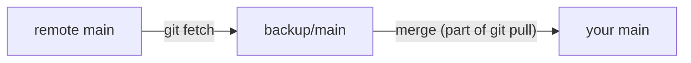

# Remotes, Push And Fetch

Astronaut, a flight log that lives only on one ship is lost with that ship. This part shows how to give your archive a second home: what a remote really is, how to create a bare repository to act as one, and how `push`, `fetch` and `pull` move history between the two.

The commands below run inside the `~/projects/recipe-notes` repository, which already has a few commits on its `main` branch.

## What a remote actually is

Beginners often think a remote is something big and mysterious. It is not a server, not a protocol and not a cloud service. A Git **remote** is only a **name mapped to a location**: a URL or, just as validly, a path on the local disk. Git records that mapping in `.git/config`. In the flight log picture, a remote is mission control's copy of the archive, and the remote's name is how your ship refers to it.

### Create a bare repository

First, create a repository to act as the remote:

```bash
git init --bare ~/projects/recipe-notes-backup.git
```

The `--bare` flag creates a repository with no working tree at all: only the object database and the references. That is exactly what lives inside the `.git/` folder of a normal repository, except that here it *is* the top directory. It is also what GitHub, GitLab and every other Git host run on their servers. A bare repository in a second local directory works just as well for learning as a real network host; Git handles both the same way.

### Register the remote

Now tell your repository about it:

```bash
cd ~/projects/recipe-notes
git remote add backup ~/projects/recipe-notes-backup.git
git remote -v
```

`git remote add` writes the name-to-location mapping into your repository's configuration. `-v` (verbose) prints both the fetch and the push location for every remote. They are usually the same unless someone set them differently on purpose.

## Pushing with upstream tracking

Pushing copies your commits to the remote. One flag on the first push saves you typing on every push after it.

### Push `main` and set the upstream

Send your `main` branch to the remote:

```bash
git push -u backup main
```

`-u` (`--set-upstream`) does two things in one command. Git pushes your `main` branch's history to `backup`, and it records, locally, that your `main` branch should follow `backup`'s `main` branch from now on. That link is why every later `git push` or `git pull` on this branch can run with no arguments: Git already knows where "there" is. Without `-u`, you would have to name the remote and the branch on every push and pull.

## Fetch vs pull

Two commands bring history back from the remote. They sound alike but do different amounts of work.

### Fetch and pull with no arguments

With the upstream set, both commands work on their own:

```bash
git fetch
git pull
```

`git fetch` downloads any new history from the remote into a **remote-tracking reference** (such as `backup/main`) and touches nothing else. Your working tree and your current branch stay exactly as they were, so you get a safe chance to look at incoming changes first. `git pull` is shorthand for `fetch` followed straight away by `merge` (or `rebase`, if your configuration says so) into your current branch.

The two are not the same: `fetch` only tells you what changed, `pull` applies it.



The diagram shows that `git fetch` stops at the remote-tracking reference, while `git pull` also merges that reference into your own branch.

## Common pitfalls

> [!WARNING]
> - **Thinking a remote must be a network server.** A local path to a bare repository is a valid remote.
> - **Pushing to a repository that is not bare.** A remote you push to should be created with `git init --bare`, so it has no working tree to get out of step.
> - **Forgetting `-u` on the first push.** Without it, plain `git push` and `git pull` do not know which remote and branch to use.
> - **Using `git pull` when you only wanted to look.** `pull` changes your current branch. Use `git fetch` to see what changed without touching your work.

## Your mission: Git Fundamentals Lab

You can now create a repository, commit changes one at a time, ignore build output and push to a remote with upstream tracking. The mission asks you to build a small tool's repository from nothing, in exactly the commits the grader expects, and connect it to a bare `origin`.

Start the mission:

```sh
astrona run --git ssh://git@github.com/astrona-io/ATS006.git -c labs/lab-041
```

Open a terminal on the lab machine:

```sh
astrona ssh ats-006-lab-041
```

Read the task in [`question.md`](../../../labs/lab-041/docs/question.md) and solve it on your own first. When you think you are done, send it for grading:

```sh
astrona submit -c labs/lab-041
```

When the mission is done, remove it:

```sh
astrona destroy ats-006-lab-041
```
