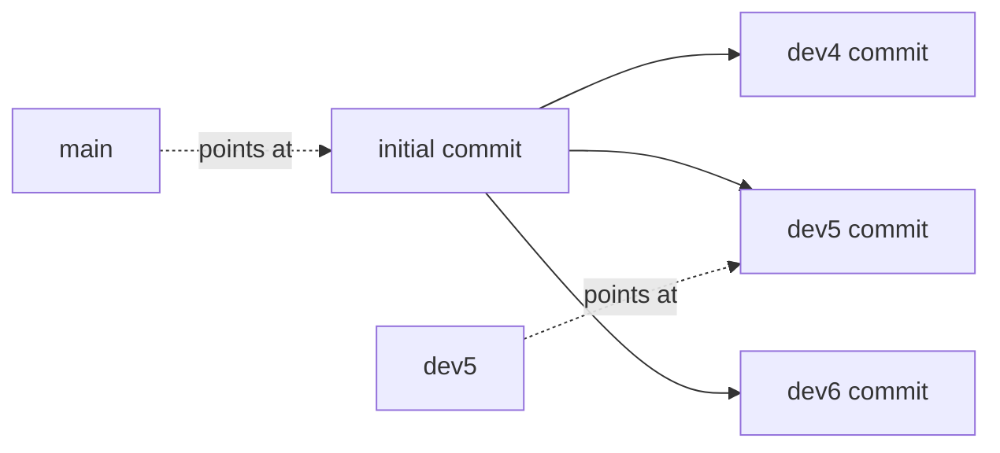

# Clone And Inspect Branches

Astronaut, before you pick a flight path you want to read every option on the chart, without flying each one. This part shows what a branch really is, what a clone brings with it, and how to read a file on any branch without leaving the one you are on.

## A branch is a pointer, not a copy

Think of a branch as a sticky marker on one entry in the flight log archive. Creating a branch does not copy any files. Git only places a new marker next to the current one. That is why Git branches are famously cheap: a branch is a few bytes of bookkeeping, not a copy operation.



The diagram shows three branches that grew from the same first commit. `main` and `dev5` are only markers that point at a commit; all the commits live in one shared archive.

## Cloning brings the whole history, not just one branch

When you clone a repository, Git does not hand you a single snapshot. It copies the entire object database, including the history of every branch.

### Clone a repository from a local path

Suppose a team keeps a blog's files in a repository at `/repositories/garden-blog`. Clone it like this:

```bash
git clone /repositories/garden-blog /home/writer/garden-blog
cd /home/writer/garden-blog
```

The source here is a path on the local disk, not an `https://` or `git@` address. `git clone` works the same way either way; only the route the data travels changes, not what Git does with it.

### List every branch

Ask Git which branches exist:

```bash
git branch -a
```

`-a` (`--all`) lists both local branches and **remote-tracking branches**, shown as `remotes/origin/<name>`. A remote-tracking branch is your ship's copy of where a branch stood at mission control the last time you talked to it. Right after a clone you usually have only one local branch checked out: the repository's default. Every other branch from the source is there as a remote-tracking reference, not yet a local branch of its own. You do not need to create a local branch, or check anything out, just to know a branch exists.

## Inspecting content across branches without checking out

Now the real task. Suppose the `garden-blog` repository has three draft branches, `draft-spring`, `draft-summer` and `draft-fall`. Each one proposes a different homepage tagline in a file called `homepage.yaml`, and you must find the one that sets `tagline: "Grow something new"` before publishing it.

The slow way is to check out each branch in turn, look at the file and switch again. That works, but it is slow, and it leaves your working tree on whichever branch you checked out last.

### Read one file on three branches

Git can print a file from any branch with `git show` and its `<revision>:<path>` form:

```bash
git show origin/draft-spring:homepage.yaml
git show origin/draft-summer:homepage.yaml
git show origin/draft-fall:homepage.yaml
```

`git show <ref>:<path>` prints a file's exact content as it is at the tip of `<ref>`. There is no checkout, no stash and no risk of disturbing anything in your working directory. This is the core technique for "which branch has X" questions: Git reads the content straight out of its object database instead of writing it to disk first.

### Scan all candidates in one loop

For many branches, a short `bash` loop puts the line you care about from each branch side by side:

```bash
for b in draft-spring draft-summer draft-fall; do
  echo "== $b =="
  git show "origin/$b:homepage.yaml" | grep tagline
done
```

`bash` runs `git show` once per branch, and `grep` keeps only the `tagline` line. The correct branch becomes obvious, and you never leave `main`.

> [!TIP]
> When a task asks "which branch has the value X", reach for `git show <ref>:<path>` in a loop before you ever reach for `git checkout`. It is faster, and your working tree stays where it is.

## Common pitfalls

> [!WARNING]
> - **Thinking a clone only brings the default branch.** Every branch comes along as a remote-tracking reference. Run `git branch -a` to see them.
> - **Checking out each candidate branch to read one file.** It is slow and leaves you on the wrong branch. Use `git show origin/<branch>:<path>`.
> - **Leaving out `origin/` in `git show`.** Right after a clone, most branches exist only as `origin/<name>`, not as local branches.
> - **Running the loop in a shell other than `bash`.** Some shells treat `$b:` specially. Run it in `bash`, as on the lab machine.
