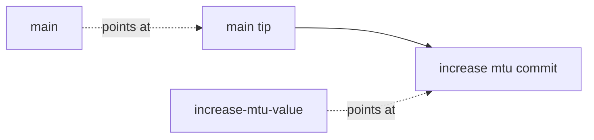

# A Topic Branch And A Focused Commit

Astronaut, before you change a shared flight log, you move onto your own flight path so nothing you do touches the shared one. This part shows what a clone sets up for you, how to create a topic branch, how to make one focused commit, and how to measure exactly what that branch adds.

The examples use a made-up network team repository at `/repositories/network-configs` with a file `interfaces.yaml` that contains the line `mtu: 1500`.

## What cloning sets up automatically

A clone does more than copy history. It also prepares your local `main` to follow mission control's `main`.

### Clone and look at the tracking link

Clone the repository and ask Git about your branch:

```bash
git clone /repositories/network-configs /home/netops/network-configs
cd /home/netops/network-configs
git status
git branch -vv
```

`git clone` checks out the source repository's default branch locally (often `main`). Without any extra configuration, it also sets that branch to **track** the matching remote-tracking branch, `origin/main`. That is why `git status` right after a clone says something like "Your branch is up to date with 'origin/main'": the link already exists. `git branch -vv` (doubly verbose) shows the link directly, printing `[origin/main]` next to `main`.

## Isolating work on a topic branch

Before you change anything, get off the shared branch and onto one that exists only for this piece of work.

### Create and switch in one step

Create the topic branch and confirm you are on it:

```bash
git switch -c increase-mtu-value
git branch --show-current
```

`git switch -c` creates the new branch from your current `HEAD` and checks it out in the same step. The older form, `git checkout -b increase-mtu-value`, does exactly the same thing. Git split the newer `switch` and `restore` commands out of the older, overloaded `checkout` so each command has a narrower job and is harder to misuse.

This difference matters more than it looks. `git branch increase-mtu-value` on its own only *creates* the branch. You stay on the branch you were on, and it is easy to keep editing files there without noticing that you never moved.

## A single, focused commit

A topic branch works best when it carries exactly one logical change, with a message that says *why*, not only *what*.

### Make the change and check it before you stage it

Change one value, review it, then commit:

```bash
sed -i 's/mtu: 1500/mtu: 9000/' interfaces.yaml
git diff
git add interfaces.yaml
git commit -m "increase mtu to 9000 for jumbo frame support"
```

`sed` makes the edit in place. Running `git diff` before staging is a deliberate checkpoint: it confirms that only the intended line changed and that nothing else crept in from an unrelated edit still sitting in the working tree.

## Measuring exactly what a branch changed

Once a topic branch has one or more commits, you often need a precise answer to "what does this branch add that `main` does not have?" Git's **two-dot range** answers it directly.

### List the commits only the branch has

Ask for the commits on the topic branch that `main` does not have:

```bash
git log main..increase-mtu-value --oneline
```

`git log A..B` lists every commit reachable from `B` but not from `A`. Read it as "what does the second branch have that the first one does not". Writing the operands the wrong way round (`increase-mtu-value..main`) answers the opposite question, which is a common reason for "why does this show nothing".

### Show the combined change

The same range works with `diff`:

```bash
git diff main..increase-mtu-value
```

`git diff` with a two-dot range shows the full content difference between the two branch tips as one patch. For a branch with one commit it looks the same as `git show` on that commit, but it also works cleanly for many commits.



The diagram shows why `main..increase-mtu-value` returns one commit: the topic branch has the extra commit, and `main` does not.

## Common pitfalls

> [!WARNING]
> - **Using `git branch <name>` and thinking you moved.** It only creates the branch. Use `git switch -c <name>`, then check with `git branch --show-current`.
> - **Mixing unrelated edits into a focused commit.** Run `git diff` before `git add` and stage only the file you meant to change.
> - **Reversing the two-dot range.** `git log main..topic` shows what `topic` adds; `git log topic..main` shows what `main` has that `topic` does not.
> - **Writing only *what* changed in the message.** Say why as well, so the next person understands the change.
