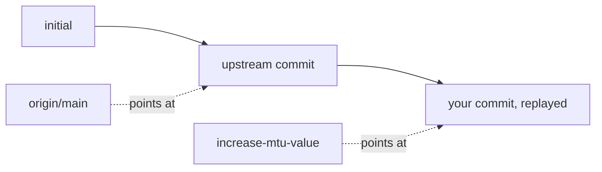

# Fetch, Rebase Or Merge

Astronaut, while you were flying your own path, mission control added a new entry to the shared flight log. This part shows how to see that entry safely with `git fetch`, how to replay your work on top of it with `git rebase`, and when a `git merge` is the better choice.

The examples continue in `/home/netops/network-configs`, where the topic branch `increase-mtu-value` carries one commit and someone else has since pushed a new commit to `origin`'s `main`.

## Fetch tells you what changed and never touches your branch

This is the most important fact in this module, so here it is as plainly as possible: **`git fetch` never changes your working directory or the branch you have checked out.**

### Fetch and compare

Download the new history and list what arrived:

```bash
git fetch origin
git log main..origin/main --oneline
```

`git fetch` downloads any new objects from the remote and moves the remote-tracking reference (`origin/main`) to the new upstream tip. Nothing else changes. Your local `main` and your topic branch stay exactly where they were. The `git log` range then lists the commits upstream has that your `main` does not.

That makes `fetch` safe to run at any time, as often as you like, just to see what changed before you decide what to do. Your checked-out branch only changes when you run `merge`, `rebase` or `pull` (which is `fetch` followed straight away by `merge`, in one command).

## Reconciling with rebase

A **rebase** replays your flight path on top of the newest one, as if you had branched off after the new upstream entry already existed.

### Rebase the topic branch onto the new upstream tip

Switch to the topic branch and rebase it:

```bash
git switch increase-mtu-value
git rebase origin/main
```

Run on the topic branch, `git rebase origin/main` lifts your branch's commits off, moves the branch's starting point to the new `origin/main` tip, and replays each of your commits on top of it, one at a time. The result reads as if you had branched off *after* the upstream change existed: a clean, straight history with no extra merge commit.



The diagram shows the history after the rebase: your commit now sits directly on top of the upstream commit, in one straight line.

### Check the shape of the history

Draw every branch as a graph:

```bash
git log --oneline --graph --all
```

If the result is one straight line, the rebase did what you wanted.

### When a rebase stops on a conflict

If the upstream change and your topic branch changed different lines of the same file, the rebase replays with no conflicts. If they changed the *same* line, Git pauses in the middle of the rebase and writes conflict markers (`<<<<<<<`, `=======`, `>>>>>>>`) into the file. Fix the file by hand, `git add` it, and run `git rebase --continue`. `git rebase --abort` is always there as a full, clean undo if a rebase turns out messier than you expected.

## When to reach for merge instead

Rebase is not always the right tool. One rule matters above all: **never rebase a branch that you have already pushed and that someone else may have built their own work on.**

Rebase rewrites commit hashes. Every commit it replays becomes a new object with a new identity, even though the content is the same. If a teammate already has a clone with the old commits, rebasing under them creates two histories that no longer share commit hashes. That is painful to untangle.

### Merge the upstream branch instead

A merge brings the upstream work in without rewriting anything:

```bash
git merge origin/main
```

A merge creates a new commit with two parents. It weaves both histories together exactly as they happened, without rewriting a single existing commit. The cost: the history gains an extra merge commit and a visible branch-and-rejoin shape instead of one straight line.

The rule of thumb: rebase freely on a small topic branch nobody else has yet, to keep the history clean. Merge once a branch is shared, or whenever keeping the true parallel timeline matters more than a tidy straight line.

> [!TIP]
> Before you rebase, ask one question: "has anyone else pulled this branch?" If the answer is yes or you are not sure, merge instead.

## Common pitfalls

> [!WARNING]
> - **Expecting `git fetch` to update your files.** It only moves `origin/main`. Your branch changes only when you merge, rebase or pull.
> - **Rebasing while on the wrong branch.** Switch to the topic branch first; `git rebase origin/main` moves the branch you are on.
> - **Rebasing a branch others already use.** Rebase gives commits new hashes. Merge a shared branch instead.
> - **Panicking at a conflict.** Fix the file, `git add` it and run `git rebase --continue`, or run `git rebase --abort` to go back.
> - **Using `git pull` when the task asks for a rebase.** Plain `pull` merges by default and can create a merge commit.

## Your mission: Git Upstream Reconciliation Lab

You can now make a focused change on a topic branch, fetch new upstream work safely and rebase your branch on top of it. The mission asks you to run that whole cycle on a shared repository, including a simulated teammate's push.

Start the mission:

```sh
astrona run --git ssh://git@github.com/astrona-io/ATS006.git -c labs/lab-043
```

Open a terminal on the lab machine:

```sh
astrona ssh ats-006-lab-043
```

Read the task in [`question.md`](../../../labs/lab-043/docs/question.md) and solve it on your own first. When you think you are done, send it for grading:

```sh
astrona submit -c labs/lab-043
```

When the mission is done, remove it:

```sh
astrona destroy ats-006-lab-043
```
