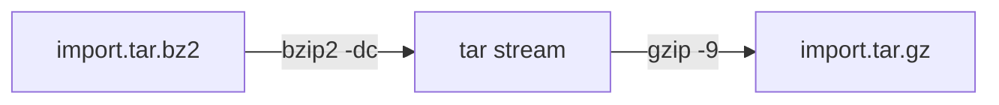

# Convert And Prove

Astronaut, converting an archive's compression format is only half the job. The other half is proving that the conversion did not drop or damage anything, and that is the half people skip under time pressure. This part shows how to compare two archives honestly, and how to convert one without ever writing to the original.

## Prove two archives hold the same content

The standard technique is simple: make a listing of each archive's contents, then compare the two listings. `tar -t` lists the archive, `sort` puts the lines in order, and `diff` compares the two files.

### Compare a bzip2 archive with a gzip archive

```bash
tar -tjf legacy-export.tar.bz2 | sort > bz2.listing
tar -tzf export-max.tar.gz      | sort > gz.listing
diff bz2.listing gz.listing
```

If `diff` prints nothing, the two archives hold the same files. Any line it prints is a real difference worth looking into.

### Why the sort step matters

`sort` matters more than it looks. `tar -t` prints entries in the order they were physically written into the archive. Two archives built separately from "the same" content rarely have the same order. One may list a subdirectory's files before its neighbours, the other after.

Without sorting, two listings of the same content in a different order give a `diff` full of noise. It looks like a mismatch, but it is not. Sorting both listings into the same fixed order first means an empty `diff` really does mean "these hold the same files", and any output is a real difference, not an ordering effect.

## Convert without touching the original

The safest way to repack a bzip2 archive's contents as gzip is to unpack into a throwaway staging directory. Never unpack into the directory where the original archive lives.

### Extract to a staging directory and repack

```bash
mkdir -p /tmp/stage
tar -xjf legacy-export.tar.bz2 -C /tmp/stage

cd /tmp/stage
tar --use-compress-program="gzip -9" -cf /srv/reports/export-max.tar.gz .
```

Here is who does what:

- **`-C /tmp/stage`** makes `tar` change into the staging directory for that one extraction. Nothing lands near the original file, and `tar` only ever opens the original archive for reading.
- **Archiving `.` from inside the staging directory** keeps the new archive's internal paths relative. They match the path style of the original, instead of carrying an absolute path from your scratch location.
- **`gzip -9`** does the compression at level 9, because `tar` pipes the stream through that exact command.

Remove the staging directory when you are done (`rm -rf /tmp/stage`). Leftover extracted files are exactly the kind of thing that confuses a later disk space check or a search for stray files.

### The faster stream-only path

Sometimes you do not need to rebuild the archive at all. You only want to change the outer compression of an existing `.tar` stream. Then you can pipe one compressor straight into another:

```bash
bzip2 -dc legacy-export.tar.bz2 | gzip -9 > export-max.tar.gz
```

`bzip2 -dc` decompresses to the terminal's output stream (stdout), and `gzip -9` packs those same bytes again at level 9. The `.tar` bytes pass between the two compressors untouched, and `tar` never runs. This avoids any risk of changing path prefixes during a manual extract and repack.



The diagram shows the stream-only path: `bzip2` unpacks the outer layer, and `gzip` packs the same `tar` bytes again. The original archive is only read.

### Practise on your own

Create a small directory called `sample` with a few test files, and archive it with bzip2: `tar -cjf sample.tar.bz2 sample/`. Then:

1. Note its size and time with `ls -la sample.tar.bz2` before you start.
2. Write a sorted listing: `tar -tjf sample.tar.bz2 | sort > sample.bz2.listing`.
3. Convert it to a level 9 gzip archive through a staging directory with `--use-compress-program="gzip -9"`, without ever opening `sample.tar.bz2` for writing.
4. Write a sorted listing of the new gzip archive the same way, and `diff` the two listing files. The output should be empty.
5. Read the gzip header's extra flags byte (offset 8) with `od -An -tu1 -j8 -N1`. It should read `2`.
6. Delete the staging directory, and confirm with `ls -la` that the size and time of `sample.tar.bz2` are unchanged.

> [!TIP]
> Make "list, sort, diff" a habit for every archive you convert or move. It takes seconds, and it is the only proof that nothing was lost.

## Common pitfalls

> [!WARNING]
> - **Comparing unsorted listings.** `tar -t` prints entries in storage order, so two good archives can look different. Always `sort` both listings first.
> - **Extracting next to the original archive.** Use a separate staging directory with `-C`, and only read the original.
> - **Archiving an absolute staging path.** Run `tar` from inside the staging directory and archive `.`, so the internal paths stay relative.
> - **Leaving the staging directory behind.** Remove it with `rm -rf` when the new archive is verified.
> - **Forgetting `-9` on the stream-only path.** `gzip` without `-9` uses its default level 6.

## Your mission: Archive Conversion & Verification Lab

You can now convert an archive to another compression format, at the strongest level, and prove that both archives hold the same files. The mission asks you to convert a real bzip2 archive on a training ship to gzip, write sorted listings of both, and leave the original untouched.

Start the mission:

```sh
astrona run --git ssh://git@github.com/astrona-io/ATS006.git -c labs/lab-051
```

Open a terminal on the training ship:

```sh
astrona ssh ats-006-lab-051
```

Read the task in [question.md](../../../labs/lab-051/docs/question.md) and solve it on your own first. When you think you are done, send it for grading:

```sh
astrona submit -c labs/lab-051
```

When the mission is done, remove it:

```sh
astrona destroy ats-006-lab-051
```
