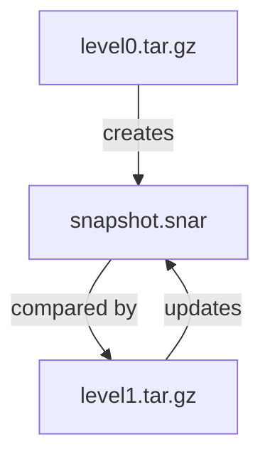

# Full And Incremental Backups

Astronaut, a full backup ships every crate, every time, whether or not anything changed. For a directory that barely changes from one day to the next, that is a lot of wasted disk work and storage for almost no new information. This part shows how `tar` ships only what changed, and which small file makes that possible.

## Full backups every night are wasteful

The fix for the waste is an **incremental backup**: a backup that holds only what is different since the last run. Think of it as shipping only the crates that changed since the last supply run, instead of the whole cargo hold again.

`tar` does this with one option, `--listed-incremental`, and one file it keeps between runs.

### Take the first backup with a snapshot file

```bash
sudo tar -czpf level0.tar.gz \
  --listed-incremental=/var/backups/snapshot.snar \
  -C / etc/nginx var/www/uploads
```

`--listed-incremental=<snapshot-file>` is what makes a backup a true incremental, instead of just another full copy with a different name. The snapshot file (by habit it ends in `.snar`) is the inventory list. `tar` writes into it, for every file, the modification time, inode number (the file's manifest card number) and size as of this run.

On the very first run the snapshot file does not exist yet. `tar` has nothing to compare against, so it creates the file, and this first run is a full backup. That is expected and correct. This first full backup is often called level 0.

### Take the next backup with the same snapshot file

The *next* run with the same snapshot file is the one that becomes a real incremental:

```bash
sudo tar -czpf level1.tar.gz \
  --listed-incremental=/var/backups/snapshot.snar \
  -C / etc/nginx var/www/uploads
```

This time `tar` reads the existing snapshot file and compares the files on disk with what it recorded. It archives only the files that are new or changed since then, and then updates the snapshot file as the new starting point for next time.

The new archive is usually much smaller than the first one. You can see that straight away by comparing the sizes with `ls -lh level0.tar.gz level1.tar.gz`.



The diagram shows the chain: the full backup creates the snapshot file, and every later run reads it, ships only the changes, and updates it.

## The snapshot file is the incremental mechanism

This is the one fact about incremental backups to remember, because it fails silently.

If the snapshot file is lost or deleted, or a different path is used by mistake, `tar` has nothing to compare against on the next run. It does not show an error. It does not warn you that the chain is broken. It simply treats the run as a fresh level 0 backup and archives everything again, exactly as if `--listed-incremental` had never been used, and it still reports success.

### How to notice a broken chain

There are only two ways to notice:

- **Check the archive size.** An "incremental" archive as big as the full one is a full copy.
- **Check the snapshot file's time.** Its modification time should match your last backup run.

Whatever runs your backups must make sure the snapshot file survives between runs. A cleanup job that does not know the file is special is a realistic way to quietly turn every "incremental" backup back into a full one.

### Practise on your own

Pick a small directory tree with one disposable subdirectory (a `tmp/` or `cache/` style folder):

1. Take a level 0 backup with `-p`, your `--exclude` and `--listed-incremental=snapshot.snar`.
2. Change one existing file and create one new file in the source tree.
3. Take a second backup with the same `--listed-incremental=snapshot.snar` path.
4. Compare the sizes of the two archives with `ls -lh`. The second one should be clearly smaller.
5. List the second archive with `tar -tzf`. It should hold your changed file and your new file, but not the files you did not touch.

> [!TIP]
> Use exactly the same snapshot path, the same `--exclude` and the same `-C` paths for every run in a chain. Write the command once and reuse it, so the runs can never drift apart.

## Common pitfalls

> [!WARNING]
> - **Leaving `--listed-incremental` off the full backup.** Then there is no starting point, and the next run is a second full copy instead of an incremental.
> - **Using a different snapshot path on the next run.** `tar` sees no snapshot file, makes a new full backup and still reports success.
> - **Deleting the snapshot file.** A cleanup job that removes `.snar` files silently breaks the chain.
> - **Trusting the exit code.** A broken chain still exits cleanly. Compare the archive sizes.
> - **Changing the exclude between runs.** Keep the same options on every run, or the chain no longer matches.
