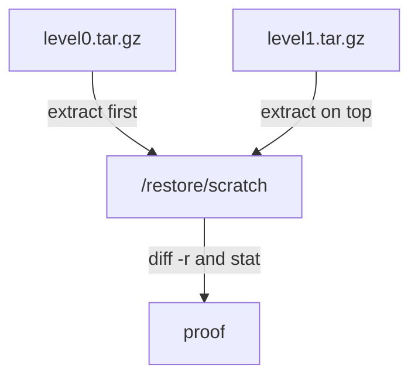

# Restore And Prove

Astronaut, a backup is only worth something if it unpacks correctly. This part shows how to restore a full backup and an incremental chain, and how to prove the result with real comparisons instead of trusting an exit code.

## A clean exit code is not proof

When `tar -x` exits with status 0, it only tells you that `tar` hit no read or write error and found no broken archive while it extracted. It says nothing about whether the extracted files, their permissions or the directory structure match what you backed up.

The only way to know a restore is correct is to compare it with a known-good original.

### Restore into a scratch directory and compare

```bash
sudo mkdir -p /restore/scratch
sudo tar -xzpf level0.tar.gz -C /restore/scratch

sudo diff -r /etc/nginx /restore/scratch/etc/nginx
```

`diff -r` walks both directory trees and reports every file that differs in content or exists on only one side. No output means the two trees are identical.

Because the archive holds relative paths, `-C /restore/scratch` puts the restored `etc/nginx` inside the scratch directory. The live `/etc/nginx` is never touched.

### Check permissions separately

Know what `diff -r` does *not* check. By default it compares file content, not ownership or permission bits. So if you need to prove that `-p` kept the permissions, compare them yourself on a file whose permissions really matter:

```bash
stat -c '%a %U:%G' /etc/shadow
stat -c '%a %U:%G' /restore/scratch/etc/shadow
```

`stat -c '%a %U:%G'` prints the mode in numbers, then the owner and group. Both lines must be the same. Do not rely on `diff -r` alone to catch a permissions problem.

## Restore an incremental chain in order

Restoring an incremental chain follows the same "layer on top" idea as the backups themselves. First extract the full (level 0) backup. Then extract each incremental archive on top of that **same** destination, in the order you took them.

### Layer the incremental on the full backup

```bash
sudo mkdir -p /restore/scratch
sudo tar -xzpf level0.tar.gz -C /restore/scratch
sudo tar -xzpf level1.tar.gz -C /restore/scratch
```

Each incremental archive lays its changed and new files over what is already there. It also carries bookkeeping for files that were deleted from the source since the previous run, and `tar` removes those from the restore too, instead of leaving them behind as stale leftovers.



The diagram shows the order: full backup first, each incremental on top of the same directory, then the comparison that proves the result.

### Restore the full backup alone, for comparison

You can also restore the full backup **alone** into a different directory. That gives you the state as of the full backup, before any later change. Comparing the two restores shows you exactly what the incremental layer added: a changed line should appear only in the layered restore, and a new file should exist only there.

### Practise on your own

Take a level 0 backup of a small directory tree with `--listed-incremental`, change one file and add one new file, then take a level 1 backup with the same snapshot file. Then:

1. Restore the full backup into one scratch directory.
2. Restore the full backup into a second scratch directory, then layer the incremental archive on top of it.
3. Run `diff -r` between the original source tree and the layered restore, leaving out the disposable directory. The output should be empty.
4. Check that your changed line and your new file appear only in the layered restore, not in the full-only restore.
5. Compare `stat -c '%a %U:%G'` on one file in the source and in each restore.

> [!TIP]
> Treat every backup as untested until you have restored it into a scratch directory and compared it. Do the comparison with `diff -r` for content and `stat` for permissions.

## Common pitfalls

> [!WARNING]
> - **Trusting a clean exit code.** `tar -x` exiting with 0 proves only that nothing errored. Compare the result.
> - **Relying on `diff -r` for permissions.** It compares content only. Check modes and owners with `stat`.
> - **Restoring the incremental alone.** It holds only the changes. Extract the full backup first, then each incremental on top.
> - **Restoring the chain out of order.** Extract the archives in the order you took them, into the same directory.
> - **Restoring over the live directory.** Restore into a scratch directory with `-C`, and compare from there.

## Your mission: tar Backup Strategy Lab

You can now take a full and an incremental backup with permissions kept and a cache left out, and prove both restores. The mission asks you to back up `/etc` and an application data directory on a training ship, take a true incremental after a change, restore both ways and prove the result.

Start the mission:

```sh
astrona run --git ssh://git@github.com/astrona-io/ATS006.git -c labs/lab-052
```

Open a terminal on the training ship:

```sh
astrona ssh ats-006-lab-052
```

Read the task in [question.md](../../../labs/lab-052/docs/question.md) and solve it on your own first. When you think you are done, send it for grading:

```sh
astrona submit -c labs/lab-052
```

When the mission is done, remove it:

```sh
astrona destroy ats-006-lab-052
```
