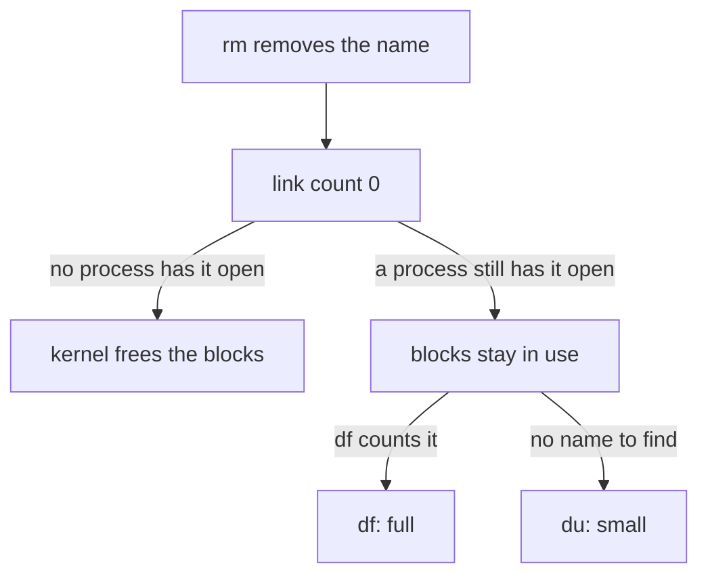

# Two Ways Of Counting Space

Every system administrator gets this alert one day: a filesystem sits at 100%. Most of the time `du` points straight at a log directory that grew too large. But sometimes `du` reports a fraction of what `df` says is in use on the very same filesystem, and deleting visible files does not close the gap. This part explains where that gap comes from.

## Two different ways of counting space

Linux has two tools that answer "how much space is used?", and they count in different ways. Think of a filesystem as a cargo deck on your ship. `df` reads the deck's fuel gauge: what the filesystem itself says is in use. `du` walks the deck and counts the crates it can see.

Run both on the same directory:

```bash
df -h /var/log
du -xsh /var/log
```

Here is what each one does:

- **`df -h`** asks the filesystem for its own bookkeeping: how many data blocks are handed out. The superblock and the inode tables hold these numbers. `-h` prints the sizes in human-readable units, such as `M` and `G`.
- **`du -xsh`** walks the directory tree and adds up the size of every file it can find by name. `-x` keeps it from wandering onto a different filesystem mounted inside the directory, which would make the comparison meaningless. `-s` prints one total instead of a line per folder.

Most of the time the two numbers roughly agree. Every block in use (`df`) belongs to a file that still has a name somewhere in the tree (`du` can see it).

The gap appears when a block is still in use, but its file has lost its last name. The fuel gauge still counts it. The crate counter has no label left to read, so it cannot count it.

## What really happens when you delete a file

To understand the gap, you need to know what `rm` really does. The answer involves two counters that the kernel, the ship's core, keeps for every file.

### Names, inodes and the link count

On Linux, every file is an **inode**: a small block of information with the file's size, its permissions and where its data blocks live. Think of it as the crate's manifest card. A directory entry is only a name that points at that inode, like a label on the crate.

`rm` removes the name, not the file. It takes one label off the crate and lowers the inode's **link count**, the number of labels that point at the manifest card.

The kernel frees the inode's blocks only when **both** of these are true:

- The link count is zero: no directory entry points at the inode any more.
- The open count is zero: no running process still has the file open.



The diagram shows the two ways a deleted file can go. If a process still holds it open, the blocks stay in use: `df` counts them, but `du` has no name to find.

### A worked example

Picture a background video worker. It opens a large temporary file at `/var/spool/videoq/render.tmp` and keeps writing frames into it. In the middle of a long job, a badly written cleanup job runs and deletes every `*.tmp` file older than an hour.

The cleanup job's `rm` succeeds at once and reports no error. But the video worker still has that exact inode open, and it keeps writing into it. Now:

- `du` can no longer see `render.tmp` anywhere, because there is no name left to find.
- `df` still shows every gigabyte of it as in use, because one open file descriptor keeps the inode alive.

In space terms: the crate is off the manifest, but a crew member is still holding it, so it still takes room on the deck.

### Try it: compare the two numbers

On your own machine, compare `df` and `du` for a directory that sits on its own filesystem, or for `/var/log`:

```bash
df -h /var/log
du -xsh /var/log
```

Read the "Used" column from `df` and the single total from `du`. If `du`'s total is far below what `df` reports for the same filesystem, the space belongs to something `du` cannot see. On a healthy system the two numbers are close. Keep in mind that `df` reports the whole filesystem, so they only match when the directory is the top of its own filesystem.

## Common pitfalls

> [!WARNING]
> - **Comparing different filesystems.** `df` always reports the whole filesystem that holds the path. Without `-x`, `du` also counts other filesystems mounted below the directory, and the comparison means nothing.
> - **Thinking `rm` frees space at once.** `rm` removes a name. The kernel frees the blocks only when no name is left **and** no process holds the file open.
> - **Trusting `du` alone.** `du` only counts files it can find by name. A deleted file that is still open is invisible to it.
