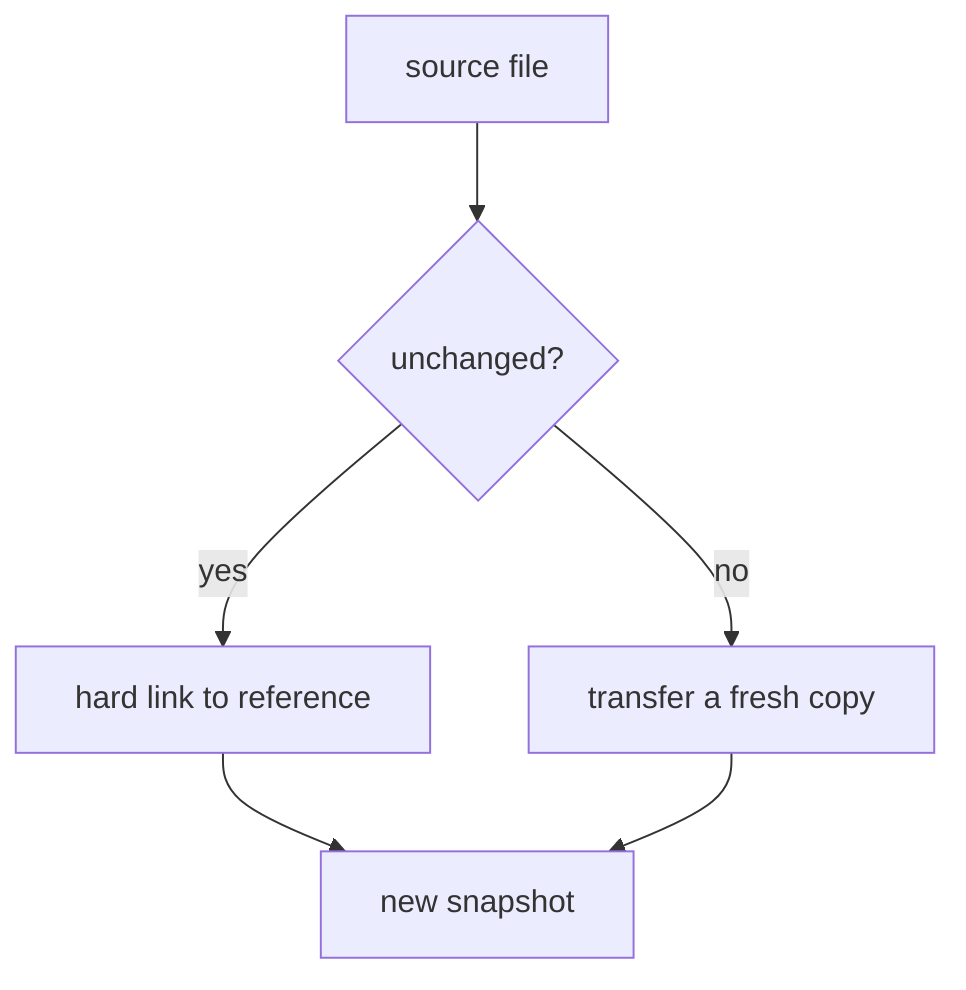

# Space-Efficient Snapshots With Link Dest

A mirror keeps one destination up to date. Sometimes you want something else: a series of dated snapshots you can browse or restore from on their own, without paying the full disk cost for each one. `rsync --link-dest` does this with hard links. This part shows how it works and how to prove it worked.

## How `--link-dest` saves space

Here is a snapshot of the photo folder, taken next to an existing mirror at `/backup/current`:

```bash
rsync -avz --exclude=cache/ -e ssh \
  --link-dest=/backup/current \
  /photos/2024-shoot/ nas:/backup/snapshots/2024-06-01/
```

For every file that is unchanged compared with the reference directory (the `--link-dest` target, here `/backup/current`), `rsync` does not send and store the content again. It creates a **hard link** in the new snapshot instead. A hard link is a second name for the same inode, like a second label on the same crate.

The result:

- The new snapshot has a full set of directory entries. `ls` shows what looks like a complete, separate copy.
- Unchanged files cost no extra disk space, because they share the inode and the data blocks that already exist.
- Only new or changed files take fresh space in the snapshot.



The diagram shows the choice `rsync` makes for each file. Unchanged files get a second label on the crate that is already in the reference directory; changed files are sent fresh.

## How this differs from a `tar` incremental backup

`--link-dest` is a different idea from `tar`'s `--listed-incremental`. Both save space, but they leave very different things on disk.

### A `tar` increment is a delta

A `tar` incremental archive is a small delta. It only has meaning when you replay it in order: first the full archive, then every increment after it. You cannot browse it or restore from it on its own.

### An `rsync` snapshot is a complete directory

An `rsync --link-dest` snapshot is a complete directory you can browse from the moment it exists. The savings happen underneath, at the inode level. Anyone who only looks at the tree does not see them.

## The same filesystem, or no savings

One rule makes or breaks the whole trick: **the `--link-dest` reference directory must be on the same filesystem as the destination.**

Hard links cannot cross from one filesystem to another, because an inode belongs to one filesystem. If the two are on different filesystems, `rsync` does not stop with an error. It quietly falls back to a full copy of every file, and you lose all the savings with no warning.

## Prove that the hard links are there

Two checks prove that the snapshot shares its unchanged files.

### Compare the real size and the apparent size

```bash
du -sh /backup/snapshots/2024-06-01
du -sh --apparent-size /backup/snapshots/2024-06-01
```

- `du -sh` reports the real disk usage. It is small, because unchanged files share inodes with the reference.
- `du -sh --apparent-size` reports the size the files would take if each one were a separate copy.

The gap between the two numbers is what `--link-dest` saved you.

### Read the link count

`stat -c '%n %h'` prints each file's name and its link count. An unchanged file in the snapshot has a link count greater than 1, because both the reference and the snapshot point at the same inode. A new file has a link count of 1.

## Practise between two local folders

You can build a snapshot chain on one machine:

1. Take a first full copy with `rsync -a` to `backup/full/`.
2. Take a second copy to `backup/snap2/` with `--link-dest=backup/full`.
3. Check that the hard links are real: `stat -c '%n %h' backup/snap2/*`. An unchanged file shows a link count greater than 1.
4. Compare `du -sh backup/snap2` with `du -sh --apparent-size backup/snap2`, and explain the gap in your own words.

## Common pitfalls

> [!WARNING]
> - **Reference on another filesystem.** Hard links cannot cross filesystems. `rsync` silently copies every file in full, and you save nothing.
> - **Treating a snapshot like a `tar` increment.** A `--link-dest` snapshot is complete on its own. You do not need to replay older snapshots to restore from it.
> - **Judging the savings with `ls`.** `ls` shows a full copy either way. Use `stat -c '%n %h'` and compare `du -sh` with `du -sh --apparent-size`.
> - **A different exclude list for the snapshot.** Use the same excludes as the mirror, so the snapshot holds the same set of files.

## Your mission: rsync Mirroring & Snapshots Lab

You can now mirror a directory safely with a dry run, `--delete` and `--exclude`, and take a snapshot that hard-links unchanged files. The mission gives you two ships flying in formation: mirror the working tree from `data-001` to `data-002` over SSH, then take a hard-linked snapshot on `data-002`.

Start the mission:

```sh
astrona run --git ssh://git@github.com/astrona-io/ATS006.git -c labs/lab-062
```

Open a terminal on the lab:

```sh
astrona ssh ats-006-lab-062
```

The task runs on `data-001`. Check which machine you are on with `hostname` before you start.

Read the task in [question.md](../../../labs/lab-062/docs/question.md) and solve it on your own first. When you think you are done, send it for grading:

```sh
astrona submit -c labs/lab-062
```

When the mission is done, remove it:

```sh
astrona destroy ats-006-lab-062
```
