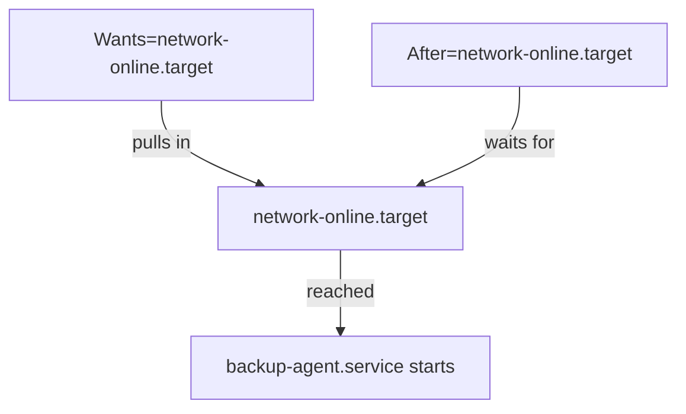

# Anatomy of a Unit File

Astronaut, a plain script is like a temporary worker you have to watch yourself. If they wander off, nobody stops them, and nobody tells you they are gone. A systemd service is that same worker hired on staff. The duty officer (systemd) checks that they are at their station, has a rule for what to do if they disappear, and keeps a duty card that says exactly how they work. That duty card is the **unit file**, and this part reads one line by line.

## A complete unit file

Every systemd service unit is a plain text file split into three sections. Start with a real one. Imagine you wrap a nightly backup script, `/opt/backup/nightly-backup.sh`, as a proper service called `backup-agent.service`.

If you have a test machine, write it down now. Save this as `/etc/systemd/system/backup-agent.service`:

```ini
[Unit]
Description=Nightly Backup Agent
After=network-online.target
Wants=network-online.target

[Service]
Type=simple
User=backupsvc
Group=backupsvc
ExecStart=/opt/backup/nightly-backup.sh
Restart=on-failure
RestartSec=5

[Install]
WantedBy=multi-user.target
```

systemd has not read this file yet, and the script and user it names do not exist yet. You add them at the end of this part.

The `[Unit]` section says what the unit is and when it starts compared to other units. The `[Service]` section says how the process runs. The `[Install]` section says what happens when you **enable** the unit. The rest of this part takes them one at a time.

## `[Unit]`: description and ordering

The `[Unit]` section describes what this unit *is* and where it fits next to other units. Two of its lines need care: the ordering line and the target it points at.

### `Description=` and `After=`

`Description=` is only for humans. It shows up in the output of `systemctl status` and nowhere else.

`After=network-online.target` is where the detail starts. `After=` is **ordering only**. It tells systemd: "if both of us are going to start, start the other one first." It does not, by itself, make systemd start the other unit at all.

If nothing else pulls `network-online.target` into the boot, a unit that only has `After=network-online.target` might start before the network is ready. The target it is ordered after was never switched on.

### `Wants=`: the line that pulls the target in

That is why `After=` almost always comes with `Wants=` (or the stricter `Requires=`). `Wants=` is the line that really says "pull this target in as something to start."

`Wants=network-online.target` plus `After=network-online.target` together is the normal, safe pair for anything that makes network calls right at startup. A backup agent that ships data to another site, a client for a web service, a program that pushes metrics: they all need both lines.



`Wants=` makes sure the target is started at all, and `After=` makes the service wait until that target is reached.

### `network.target` or `network-online.target`

These two names look alike but mean different things:

- `network.target` is reached very early in boot. It only means the network *stack* is set up as far as systemd cares. It says nothing about whether an interface has a route or a working connection yet.
- `network-online.target` is only reached once a network management service (systemd-networkd or NetworkManager) reports that at least one interface is really usable.

If your service makes a real network call when it starts, you want `network-online.target`. Using `network.target` instead is a classic cause of "it works when I start it by hand, but fails right after boot".

## `[Service]`: how the process runs

The `[Service]` section tells systemd how to launch the process, as which user, and what to do when it stops. These lines decide how safe and how steady the station is.

### `Type=`, `User=` and `Group=`

`Type=simple` tells systemd that the process started by `ExecStart=` *is* the main service process. It does not fork into the background, and there is no separate process ID file to track.

`User=` and `Group=` keep the script from running as root. You create a dedicated, unprivileged system account for the service and run it as that account. Think of it as a crew member with a small, fixed set of rights: a bug in the script cannot touch anything that account cannot reach.

### `Restart=` and `RestartSec=`

`Restart=on-failure` is a policy, and the exact value matters. systemd supports several values: `no` (the default, never restart), `on-success`, `on-failure`, `on-abnormal`, `on-watchdog`, `on-abort` and `always`.

- `on-failure` restarts the unit only when the process exits with a non-zero code or is killed by certain signals. A clean, deliberate stop with `systemctl stop` does *not* trigger a restart.
- `always` is broader. It restarts after *any* exit, including a deliberate stop. That is rarely what you want for something you sometimes manage by hand.

`RestartSec=5` adds a short pause between restart attempts. This matters more than it looks. Without it, a script that crashes the moment it starts would make systemd restart it again and again in a tight loop.

## `[Install]`: what "enabled" really means

The `[Install]` section is only read when you enable or disable the unit. It decides whether the station is on the launch checklist for the next boot.

### `WantedBy=` and the symbolic link

`WantedBy=multi-user.target` is read by `systemctl enable`. When you run `systemctl enable backup-agent.service`, systemd reads this line and creates a symbolic link to the unit inside `multi-user.target.wants/`. That link is the whole mechanism that starts the unit on future boots.

### Start and enable are two separate switches

Nothing about `enable` starts the unit *right now*. Nothing about `start` makes it survive a reboot. They are two independent switches:

| Command | Runs it now? | Survives reboot? |
|---|---|---|
| `systemctl start <unit>` | Yes | No |
| `systemctl enable <unit>` | No | Yes |
| `systemctl enable --now <unit>` | Yes | Yes |

A task that says "make sure it is running and comes back after a reboot" needs `enable --now`, or the two commands run one after the other. Using only one of them is one of the most common ways to half-finish a task without noticing.

> [!TIP]
> When a task says "running" and "after a reboot" in the same sentence, reach for `systemctl enable --now`. It flips both switches in one command.

## Give the unit something to run

The unit file you saved names a script and a user. Now create both on your test machine, so the duty card points at something real.

### Save a script that loops

Any long-running script will do. If you do not have one, write a small one that loops and sleeps. Create its folder first:

```sh
sudo mkdir -p /opt/backup
```

Save this as `/opt/backup/nightly-backup.sh`:

```bash
#!/usr/bin/env bash
while true; do
  echo "$(date) backup agent heartbeat"
  sleep 30
done
```

Make it executable:

```sh
sudo chmod +x /opt/backup/nightly-backup.sh
```

### Create a dedicated system user

Create the unprivileged account the service runs as. It gets no home directory and no login shell:

```sh
sudo useradd --system --no-create-home --shell /usr/sbin/nologin backupsvc
```

`--system` gives the account a system user ID (below 1000 on Ubuntu). `/usr/sbin/nologin` means nobody can log in as it. Your unit now runs the script as `backupsvc`, restarts it `on-failure`, and is ordered after `network-online.target` with both `After=` and `Wants=`. systemd still has not read the file: loading it is the next step.

## Common pitfalls

> [!WARNING]
> - **`After=` without `Wants=`.** `After=` only sets the order. If nothing pulls the target in, your service can start before the network is up.
> - **`network.target` instead of `network-online.target`.** `network.target` does not mean the network works. Use `network-online.target` for services that call out at startup.
> - **`Restart=always` when you mean `on-failure`.** `always` also restarts after a deliberate stop.
> - **No `RestartSec=` on a script that crashes at once.** systemd restarts it in a tight loop.
> - **Running the script as root.** Create a system user and set `User=` and `Group=`.
> - **Thinking `enable` starts the service.** `enable` only affects the next boot. Use `enable --now` for both.
