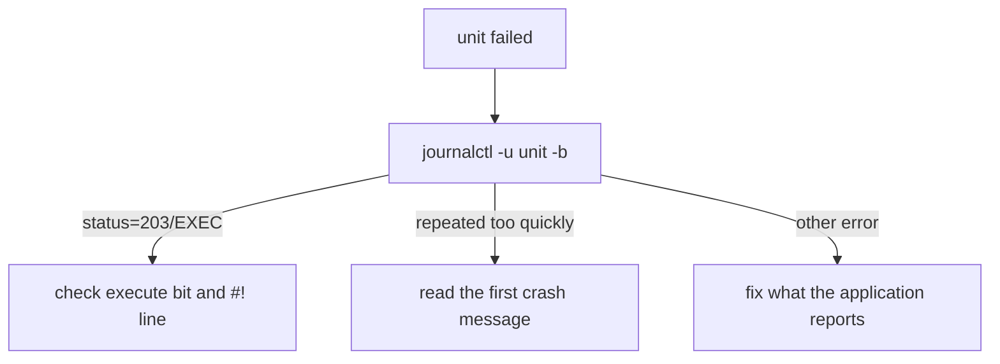

# Diagnose a Unit That Will Not Start

Astronaut, sooner or later a station refuses to come up. `systemctl status` reports the unit as `failed`, or stuck cycling through `activating (auto-restart)`. The urge is to open the unit file and start changing lines. Resist it. The duty officer (systemd) already wrote down what went wrong in the ship's log, the **journal**. This part shows you how to read it, and two failures you should recognise on sight.

The commands below use the `backup-agent.service` unit, saved at `/etc/systemd/system/backup-agent.service`, which runs `/opt/backup/nightly-backup.sh` as the system user `backupsvc`. Any service of your own works the same way.

## Read the journal first

The first move is always the journal, not the unit file. It holds the error the application itself printed, which `systemctl status` usually cuts off.

### Filter the journal to one unit and this boot

Run:

```sh
journalctl -u backup-agent.service -b
```

`journalctl` reads the journal. `-u <unit>` keeps only this unit's log lines. `-b` keeps only lines from the current boot.

### What `systemctl status` shows, and what it hides

`systemctl status` shows only the last few log lines, plus a summary line from systemd such as:

```text
Main process exited, code=exited, status=1/FAILURE
```

Read that line in two halves:

- `status=1` is the *application's own* exit code. It only means something in the context of that program's documentation.
- `code=` tells you *how* the process ended: a normal exit (`exited`) or being killed by a signal.

The full `journalctl` output almost always contains the real error the application printed: a missing file, a permission error, a problem in its own configuration. `systemctl status` alone often cuts that line away.

## Two failures to recognise on sight

Two exit conditions come up again and again. Learn to spot them, because each one points straight at its cause.

### `status=203/EXEC`

`status=203/EXEC` means systemd could not even run the command in `ExecStart=`. The usual causes are a missing execute permission on the script, or an interpreter path in the first line of the script (the `#!` line) that does not exist on this system.

Confirm it by running the exact command yourself, as the service's own user:

```sh
sudo -u backupsvc /opt/backup/nightly-backup.sh
```

This almost always shows the same failure, with a much clearer error message.

### "Start request repeated too quickly"

If the journal shows the unit starting, crashing and starting again, ending in `start request repeated too quickly`, the process is crashing the moment it launches. systemd's built-in rate limit has stepped in and stopped restarting it.

Look in `journalctl` for whatever the script printed on that very first crash. The fix is almost never in the unit file. It is in whatever the application is failing to do.



Every path starts at the journal, and the message there decides where you look next.

## Break a unit on purpose

The best way to learn the journal is to break something you control and read what systemd writes.

### Typo the `ExecStart=` path and read the result

Open `/etc/systemd/system/backup-agent.service` in an editor and change the `ExecStart=` line so the path has a typo, for example `/opt/backup/nightly-backupp.sh`. Then load the change and try to start it:

```sh
sudo systemctl daemon-reload
sudo systemctl restart backup-agent.service
```

Now diagnose it the right way, starting with the journal:

```sh
journalctl -u backup-agent.service -b
```

Find the line that names the missing file, and the exit status systemd recorded. Only then fix the path in the unit file, run `sudo systemctl daemon-reload` again, and restart the service.

> [!TIP]
> When a service fails in the exam, your first command is `journalctl -u <unit> -b`, not your editor. It saves you from "fixing" lines that were never broken.

## Common pitfalls

> [!WARNING]
> - **Editing the unit file before reading the journal.** The error is usually in the application, not the unit.
> - **Trusting `systemctl status` alone.** It cuts off the log. Run `journalctl -u <unit> -b` for the full story.
> - **Reading `status=1` as a systemd error.** It is the application's own exit code; `code=` says how it ended.
> - **Ignoring `203/EXEC`.** It means systemd could not run the command at all: check the execute bit and the `#!` line.
> - **Fixing the file and forgetting `daemon-reload`.** systemd keeps running the old, broken definition.
