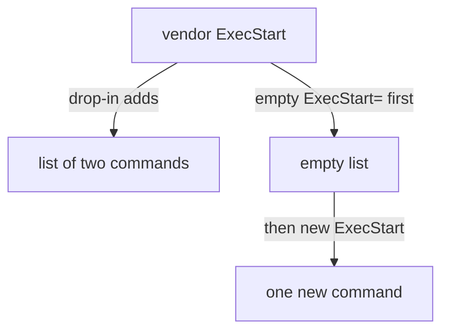

# Write a Drop-In Override

Astronaut, imagine a package installs `cups.service`, the print service. You need it to restart by itself if the print daemon crashes, and the stock unit does not do that. This part shows why you leave the package's duty card alone, and how a **drop-in override**, a sticky note on that card, makes the change instead.

## Why you never edit the vendor unit file

The tempting move is to open `/usr/lib/systemd/system/cups.service` in an editor and add the line. Do not. This section explains what happens to that edit.

### The package manager owns that file

That file is tracked by the package manager. The next time the package is upgraded, one of two things happens:

- The package's own copy of the unit quietly overwrites your hand-edit.
- The package manager raises a "modified configuration file" conflict. An unattended upgrade usually settles that by keeping the *package's* version anyway.

Either way, your change does not survive. Think of the vendor unit file like the walls of a rented flat: you do not get to repaint them, because the landlord (the package manager) redecorates on their own schedule and will not remember what you did.

## `systemctl edit`: where the override lives

`systemctl` has a command that writes the sticky note for you, in a place the package manager never touches. Start with the real command, then look at where its file goes.

### Open a drop-in for a service

Run:

```sh
sudo systemctl edit cups.service
```

`systemctl` opens your editor (the one in `$EDITOR`) on a file it creates if it does not exist yet. The usual path is `/etc/systemd/system/cups.service.d/override.conf`.

Note carefully what that path is *not*. It is not a copy of the vendor unit, and it is not under `/usr/lib/systemd/system/` at all. It is a fragment that systemd lays on top of whatever it loads from the package location.

### Type the lines you want to change

Type this into the editor and save:

```ini
[Service]
Restart=on-failure
RestartSec=5
```

That is enough. You never touch `/usr/lib/systemd/system/cups.service`. The next package upgrade can replace that file freely, and your override survives in `/etc/systemd/system/`. Package managers only own the files they installed, not files an administrator created separately under `/etc`.

### A drop-in or `--full`

There is a second tool for a different job:

```sh
sudo systemctl edit --full cups.service
```

`--full` opens a complete, standalone local copy of the whole unit, saved to `/etc/systemd/system/cups.service`. That copy *fully shadows* the vendor version: it replaces it entirely instead of sitting on top.

Use `--full` only when you really need to rewrite most of the unit. For a change to one or two lines, a plain drop-in is almost always better. It stays a small note, instead of a whole card you must keep in step with future vendor changes by hand.

## How merging works

systemd reads the vendor unit first and then each drop-in. What happens to a line that appears in both depends on the kind of line. There are three cases to know.

### Single-value lines: the last one wins

For most lines, the drop-in's value comes after the vendor's own lines. For a setting that holds one value, the *last* value loaded wins. Your drop-in's value overrides the vendor's, cleanly.

`Restart=` and `RestartSec=` both work this way. Setting them in the override is enough on its own.

### `Environment=`: values add up

`Environment=` is a special case worth knowing by name: it adds up. Several `Environment=` lines, in the same file or spread over the vendor unit and one or more drop-ins, all contribute variables. The last one does not wipe out the others.

Add `Environment=APP_ENV=production` to a drop-in and it simply joins whatever the vendor unit already set. You do not need to clear anything first.

### The `ExecStart=` trap

Not every line behaves like `Restart=`. `ExecStart=` (and a few other lines that hold a list) **appends** to an internal list instead of replacing the earlier value.

So simply adding a second `ExecStart=` in a drop-in does not swap out the vendor's command. systemd tries to keep both. The unit often still starts, using whichever command systemd picks from that list, just not the one you meant, and with no clear error telling you why.

The documented fix is an empty line first. To change the start command of the print service, the drop-in looks like this:

```ini
[Service]
ExecStart=
ExecStart=/usr/sbin/cupsd -f -c /etc/cups/custom-cupsd.conf
```

An `ExecStart=` with nothing after the `=` is a special case in systemd. It means "throw away every `ExecStart=` value collected so far, including the vendor unit's". Only after that reset does the next line become the one real start command.



Without the empty line, the drop-in adds to the list; with it, the list is cleared and holds only your new command.

> [!TIP]
> Whenever you override `ExecStart=` in a drop-in, write the empty `ExecStart=` line first. The failure without it does not look like an error, so make it a habit rather than something you debug later.

## Write a drop-in on your own machine

Now write a sticky note of your own. Pick any service on your test machine that a package installed and that is already running. The commands below write it as `<unit>`: put its name there.

### Look at the vendor's duty card

Show the unit exactly as systemd loads it today:

```sh
systemctl cat <unit>
```

Then ask systemd where the unit file came from:

```sh
systemctl show <unit> -p FragmentPath
```

`FragmentPath` should point under `/usr/lib/systemd/system/` or `/lib/systemd/system/`. That is the package-owned location you will not touch.

### Add one line the vendor does not set

Open a drop-in:

```sh
sudo systemctl edit <unit>
```

Add a line the vendor unit does not already set, for example:

```ini
[Service]
Restart=on-failure
```

Save and close the editor. The note now sits in a folder under `/etc/systemd/system/` named after the unit with `.d` on the end, but the running service does not know about it yet. Making it take effect is the next step.

## Common pitfalls

> [!WARNING]
> - **Editing the file under `/usr/lib/systemd/system/`.** The next package upgrade overwrites it or keeps the package's version. Use `systemctl edit`.
> - **Using `--full` for a one-line change.** It replaces the whole vendor unit, and you must then keep it in step by hand.
> - **Adding a second `ExecStart=` without an empty one first.** systemd keeps both in a list instead of replacing the vendor's command.
> - **Clearing `Environment=` you did not need to clear.** `Environment=` lines add up; a new one simply joins the others.
> - **Thinking saving the file is enough.** systemd has not read the drop-in yet: it still needs `daemon-reload` and a restart.
