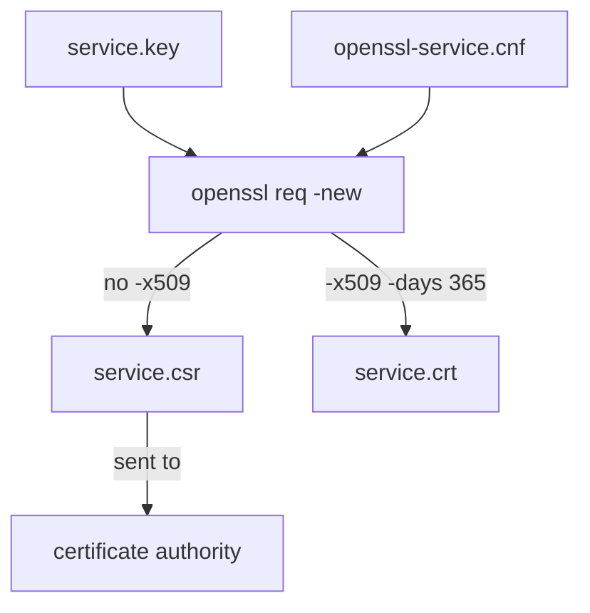

# Self-Signed Certificates and Signing Requests

Astronaut, with a secret seal and a list of names ready, you can now make the badge itself. There are two ways. You can stamp the badge yourself: a **self-signed certificate**. Or you can fill in a badge application form, a **CSR** (certificate signing request), and send it to the badge office, a **certificate authority**, to stamp. In TLS (Transport Layer Security) both come from the same `openssl` command, and this part makes both.

The commands below need the private key `service.key` and the configuration file `openssl-service.cnf` (with its `[req]`, `[dn]`, `[req_ext]` and `[alt_names]` sections for `grafana.internal.example.com`) in your current folder.

## One command, two results

Both results come from the `openssl req -new` command family. It builds a request: the name fields, the public key and the extensions you asked for, such as the SAN (Subject Alternative Name, the names printed on the badge). Then it signs it. The difference is *who* signs it and what comes out at the end.



The same key and configuration file give a request when you leave out `-x509`, and a finished self-signed certificate when you add it.

## Make a certificate signing request

A CSR signs the request with only the *applicant's own* private key and stops there. It is an unsigned badge waiting for an outside certificate authority to review it and issue a real certificate from it.

### Generate the CSR

Run:

```sh
openssl req -new \
  -key service.key \
  -out service.csr \
  -config openssl-service.cnf
```

`openssl` reads the name fields and, because there is no `-x509`, the `req_extensions` line from the configuration file. It writes the request to `service.csr`.

## Make a self-signed certificate

Adding `-x509` to the same command skips the whole outside step. `openssl` signs the request itself, at once, and writes a finished, usable certificate instead of a request.

### Generate the self-signed certificate

Run:

```sh
openssl req -new -x509 \
  -key service.key \
  -out service.crt \
  -days 365 \
  -config openssl-service.cnf
```

This time `openssl` reads the `x509_extensions` line, so the SAN goes into the certificate. The result, `service.crt`, is a badge the ship stamped for itself. That is fine for internal use, where you already trust yourself, but a stranger's browser will not trust it by default.

### Always set `-days`

Always give `-days` yourself. Without it, OpenSSL falls back to a much shorter default validity that can differ between builds and distributions. That is fine for a five-minute test, and a bad surprise for anything meant to last.

> [!TIP]
> To turn a working CSR command into a self-signed certificate command, change only two things: add `-x509` and `-days`, and point `-out` at a `.crt` file. Same key, same configuration file.

## Common pitfalls

> [!WARNING]
> - **Leaving out `-x509` when you need a certificate.** You get a request (`.csr`), not a usable certificate.
> - **Leaving out `-days`.** The default validity is short and differs between builds.
> - **A configuration file with only `req_extensions`.** The self-signed certificate then has no SAN; add `x509_extensions` as well.
> - **Using a different key for the CSR and the certificate.** Use the same `-key` for both, or they will not belong to the same seal.
> - **Expecting a self-signed certificate to be trusted everywhere.** Only machines that already trust your own stamp accept it.
